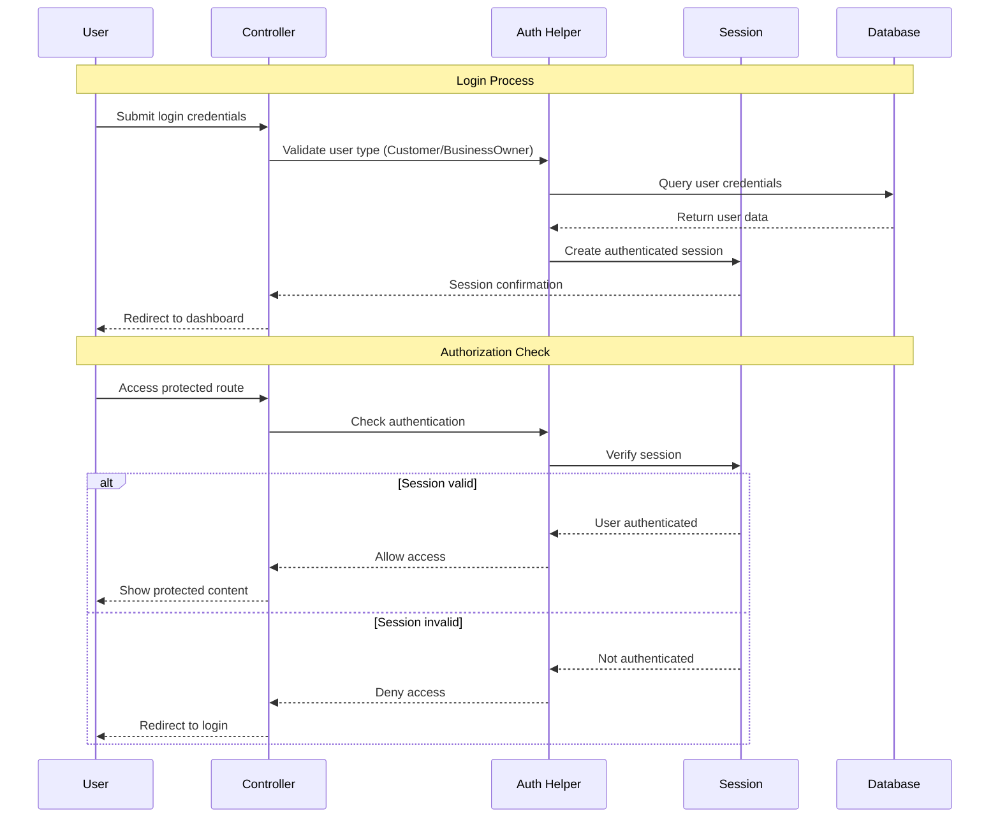
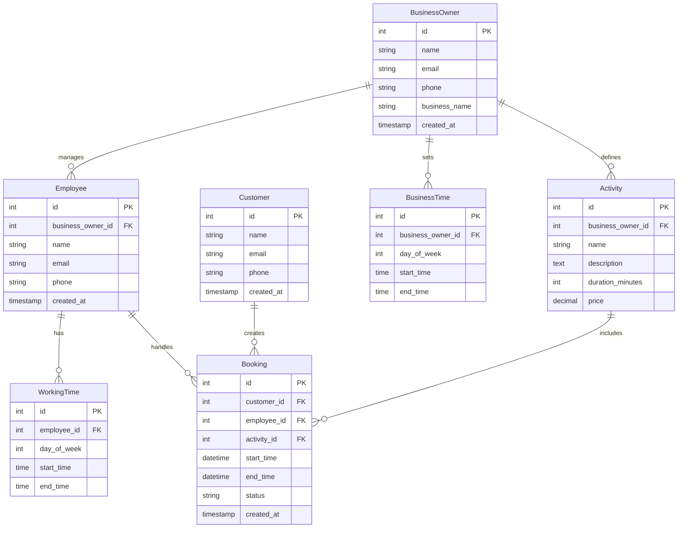
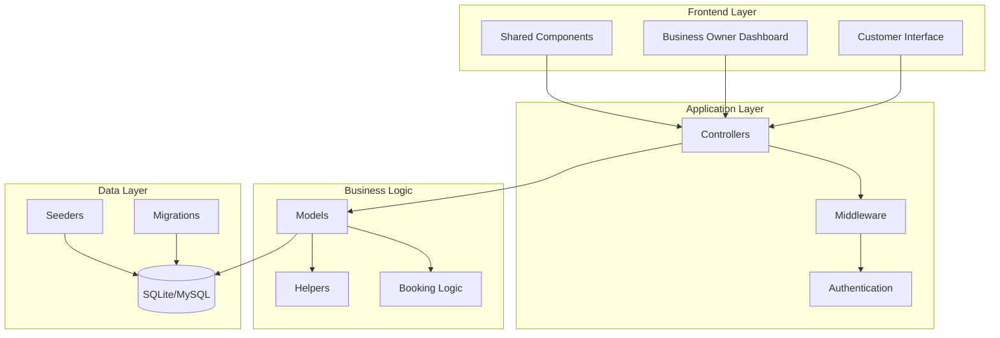
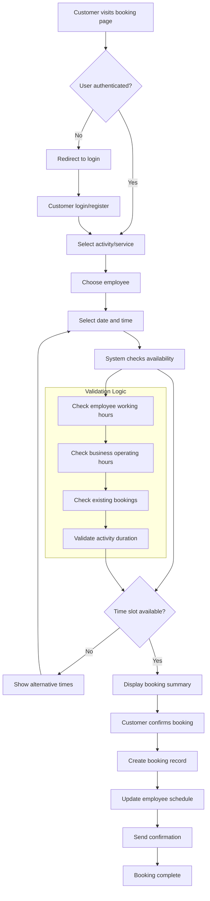

# Laravel Appointment Booking System

A comprehensive appointment booking system built with Laravel, designed for businesses to manage employee schedules, customer bookings, and service offerings. Originally developed as a university project, it has been modernized and enhanced with AI-powered development tools.

## Features

### For Business Owners
- Complete business management dashboard
- Employee scheduling and roster management  
- Activity/service type configuration
- Booking oversight and history tracking
- Business hours and availability settings

### For Customers
- Easy appointment booking interface
- Personal booking history and management
- Service browsing and selection
- Account registration and authentication

### System Features
- Dual authentication system (Business Owner & Customer)
- Calendar-based scheduling views
- Automated booking validation and conflict detection
- Timezone-aware scheduling (Australia/Melbourne)
- Responsive web interface

### Authentication Flow



## Technology Stack

- **Laravel 5.4** - PHP web framework
- **PHP >= 5.6.4** - Server-side language
- **Composer** - Dependency management
- **SQLite** (development) / **MySQL** (production) - Database
- **Blade** - Server-side templating engine
- **Laravel Dusk** - Browser automation testing
- **Laravel Mix** - Asset compilation
- **Bootstrap** - Frontend framework

## Architecture Overview

### Core Models & Relationships



### System Architecture



### Key Features
- Custom dual authentication system
- Calendar-based scheduling interface
- Automated time conflict detection
- Employee availability matching
- Custom helper system for common utilities

## Quick Start

### Option 1: Dev Container (Recommended)

The fastest way to get started is using the pre-configured Dev Container that includes all dependencies.

#### Prerequisites
- [Visual Studio Code](https://code.visualstudio.com/)
- [Dev Containers extension](https://marketplace.visualstudio.com/items?itemName=ms-vscode-remote.remote-containers)
- [Docker Desktop](https://www.docker.com/products/docker-desktop/)

#### Setup
1. **Clone and open in VS Code**
   ```bash
   git clone <repository-url>
   cd laravel-appointment-booking-system
   code .
   ```

2. **Open in Dev Container**
   - VS Code will detect the Dev Container configuration
   - Click "Reopen in Container" when prompted
   - Or use Command Palette: `Dev Containers: Reopen in Container`

3. **Automatic setup**
   - The container will automatically:
     - Install PHP 7.4, Composer, Node.js 16
     - Install all PHP and Node.js dependencies
     - Create and configure `.env` file
     - Generate application key
     - Set up SQLite database
     - Compile frontend assets
     - Configure Apache web server

4. **Start the application**
   ```bash
   php artisan serve
   ```

5. **Visit your application**
   
   Open [http://localhost:8000](http://localhost:8000) in your browser

#### Dev Container Features
- ✅ Pre-configured PHP 7.4 with all required extensions
- ✅ Laravel-optimized VS Code extensions
- ✅ Automatic dependency installation
- ✅ Database migration and seeding
- ✅ Asset compilation
- ✅ Testing environment (PHPUnit & Dusk)
- ✅ Apache web server configuration

### Option 2: Manual Installation

If you prefer to set up the environment manually:

#### Prerequisites
- [PHP](http://php.net/) >= 5.6.4
- [Composer](https://getcomposer.org/) >= 1.4.1
- Git
- Node.js & yarn (for asset compilation)

#### Setup Steps
1. **Clone and setup**
   ```bash
   git clone <repository-url>
   cd laravel-appointment-booking-system
   cp .env.example .env
   ```

2. **Install dependencies**
   ```bash
   composer install
   yarn install
   ```

3. **Configure database**
   
   Update your `.env` file:
   ```env
   DB_DATABASE=/path/to/project/database/dev.database.sqlite
   ```

4. **Generate application key**
   ```bash
   php artisan key:generate
   ```

5. **Start development server**
   ```bash
   php artisan serve
   ```

6. **Visit your application**
   
   Open [http://localhost:8000](http://localhost:8000) in your browser

## Development Workflow

### Booking Process Flow



### Asset Compilation
```bash
yarn dev        # Compile assets for development
yarn watch      # Watch files and recompile on changes  
yarn production # Compile optimized assets for production
```

### Testing
```bash
# Unit and Integration Tests
vendor/bin/phpunit
# or
./unit.bat

# Browser Tests (Laravel Dusk)
php artisan dusk
```

### Database Management
The application uses SQLite for development. The database file is located at:
```
database/dev.database.sqlite
```

For production deployments, configure MySQL in your `.env` file.

## Project Structure

```
app/
├── Http/Controllers/     # Application controllers
├── Helpers/             # Custom utility helpers
├── *.php               # Eloquent models
resources/
├── views/
│   ├── admin/          # Business owner interface
│   ├── customer/       # Customer interface  
│   └── shared/         # Reusable components
database/
├── migrations/         # Database schema
└── seeds/             # Test data
tests/
├── Browser/           # Dusk browser tests
├── Integration/       # Integration tests
└── Unit/             # Unit tests
```

## Deployment

### Production Setup
1. Configure `.env` for production environment
2. Set up MySQL database
3. Run `composer install --optimize-autoloader --no-dev`
4. Run `yarn production`
5. Configure web server (Apache/Nginx)

## Troubleshooting

### Common Issues

**Application key error:**
```bash
php artisan key:generate
```

**Database connection issues:**
- Verify database file path in `.env`
- Ensure PHP SQLite extension is enabled
- Check file permissions on database directory

**Asset compilation errors:**
```bash
yarn install
yarn dev
```

**MySQL PDO extension missing:**
Enable in `php.ini`:
```ini
extension=pdo_mysql
```

## Contributing

This project welcomes contributions. Please ensure:
- Follow Laravel coding standards
- Write tests for new features
- Update documentation as needed

## Contributors

- **Johnny Huynh** - Project maintainer and modernization
- **Historical Contributors** - Lachlan Porter, Craig Barry, Jarry Chen

## License

MIT License - see LICENSE file for details